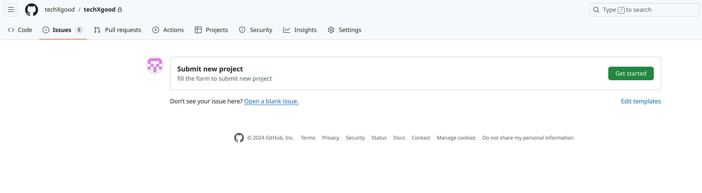
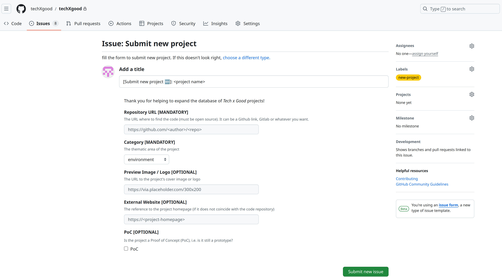

# Contributing
There are three ways to contribute to this project:
- by modifying the code of the techXgood site and then making pull requests to this repository;
- by submitting new projects to be added to the techXgood database;
- by contributing to one of the many forks within the techXgood account.

## Issues
There are two types of issues you can open:
the first is to request the submission of a project 
(Submit new project template), the second, however, is to report a 
problem related to the code itself; in this case you can use a generic, 
white issue.

### Submit new project issue template
To submit a new project you can use the appropriate template.
Go to the issue section and select the related template: Submit new issue.

You will be presented with this screenshot to fill in 
(at least the required fields). Remember to enter the correct 
label (new-project) as well. After that submit the issue and we 
will review the request. If successful, the project will be added to 
the database.

## Pull Request Process
1. Fork the repository.
2. Commit your changes to your fork.
3. Submit a pull request.
4. Handle any feedback before the request is merged.
5. Accept our sincere Thank You!

## Code of Conduct
Very simple: be polite 😇